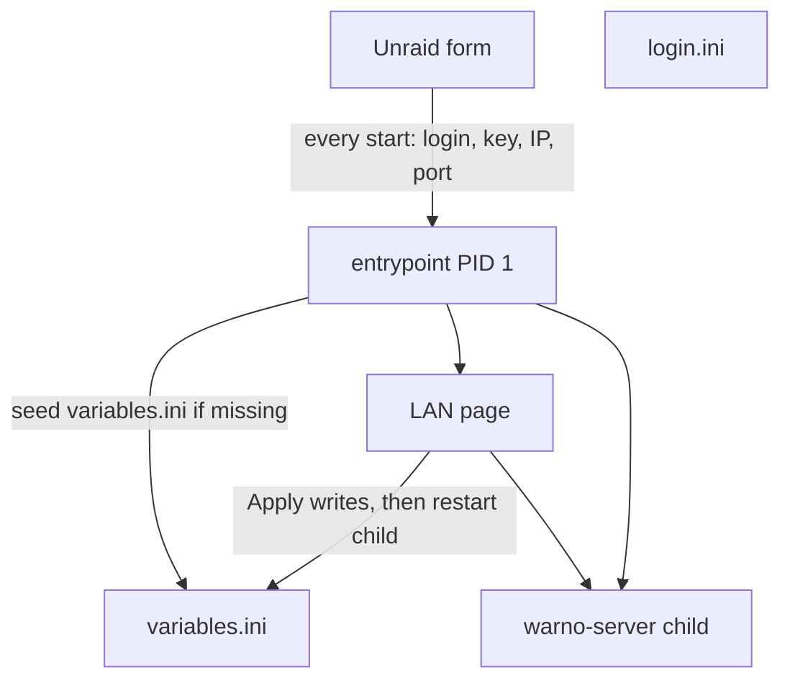

# Lobby web UI feasibility

Feasible. The page is a second writer of `variables.ini` plus a restart of `warno-server`. Eugen already loads that file at start ([variables.ini](https://hub.docker.com/r/eugensystems/warno), fetched this session). No new game API.

## Decisions already made

- One template. New variable `WEB_UI`, default `false`, advanced. `false` keeps today's path: [entrypoint-unraid.sh](entrypoint-unraid.sh) writes the three files and `exec`s `/server/entrypoint2.sh`.
- The page is the whole lobby: map, slots, combat rule, mod list, and the match rules. Login, dedicated key, public IP, and game port stay on the Unraid form.
- Open on the LAN, no password. Default off.
- Apply restarts the game process immediately. The current match ends. The container stays up, so the page stays open.

## Why this fits the container

Today the wrapper becomes the game process, and `WRITE_CONFIG=true` rewrites `variables.ini` from the Unraid form on every start ([docs/DECISIONS.md](docs/DECISIONS.md), "Form-written settings"). A page that only edits the file would lose those edits on the next Unraid restart.

When `WEB_UI=true`:

- `login.ini` is still rewritten from the form on every start. The key stays in Unraid and never appears in the page or its log.
- `variables.ini` is seeded from the form only when the file is missing. After that the page owns it.
- A **Reset from Unraid form** button writes the form values again and restarts the game.
- `params_for_ai.json` stays the empty deck lists. No deck editor.
- The entrypoint stays PID 1, holds `warhost.lock`, and starts Eugen's entrypoint as a child in its own process group. Apply signals that group and starts it again. The lock must stay in the parent across that restart.

`WRITE_CONFIG=false` with the page on still requires the three files to exist. The page may then edit `variables.ini`.

## What the buttons are

Same column as the in-game Game parameters list, plus map and mods. Store gallery shots are battle scenes; the control list below is Eugen's `variables.ini` keys, which are that column.

Buttons for values Eugen enumerates:

- Sides: `GameType` 0 NATO vs PACT, 1 NATO vs NATO, 2 PACT vs PACT, 3 PACT vs NATO
- Mode: `CombatRule` 1 Destruction, 2 Conquest
- Income: `IncomeRate` 0 None through 5 Very high
- Observers: `AllowObservers` 0 or 1
- Swapped spawns: `InverseSpawnPoints` 0 or 1
- Map: one button per scenario ID already listed in [README.md](README.md), grouped the way that file groups them (102 base, Red Dragon, and the other named packs). Army General `SM_` names stay out; this repo has not seen them used as a lobby map.
- Mods: one toggle per named README mod, value `id/version` from that README, joined with hyphens. Empty means a base-game server. The page does not query Steam. Tags (`ModTagList`) follow the mods, using the tag strings already recorded for each pack.

Stepped controls where Eugen documents the unit and the default, and the page picks the steps: time (`TimeLimit` seconds, 0 unlimited, default 1200), score (`ScoreLimit` default 2000), starting points (`InitMoney` default 750), upkeep percent (`Upkeep` default 0, the Command and Control control), team balance (`DeltaMaxTeamSize`, seed 0 as the wrapper does today), and the four phase timers with Eugen's minimums (`WarmupCountdown` at least 10, `LoadingTimeMax` at least 60, `DeploiementTimeMax` at least 10, `DebriefingTimeMax`). Slot steppers use the checks already in the entrypoint: max 1–20, minimum at most max, team size at most max.

Two text fields: server name (no `=`, no line break) and the optional game join password (`Password`). That password is the lobby password, separate from any Unraid field.

Map choice and combat rule stay independent. The page can hint from `CONQ` or `DEST` in the ID. Eugen does not lock player count to the size in the ID; the page should say the same thing the README already says.

Out of scope: map rotation and `maps.ini`, AI decks, `CoopVsAI`, `AutoFillAI`, RCON. Eugen documents `setsvar` for live changes; this page does not use it.

## One template, many servers

`WEB_UI=false` starts no listener and no extra process.

`WEB_UI=true` listens on game port + 1000. Server `10400` is `http://<unraid>:11400/`. Thirty servers on `10400`–`10429` use `11400`–`11429`. Refuse the start if that port is already taken, using the same local-port check as the game port. Game ports must not sit in that web-port block.

Host networking has no published port, so Unraid will not rewrite `[PORT:…]` to a mapped port. [DockerClient.php](https://github.com/unraid/webgui/blob/master/emhttp/plugins/dynamix.docker.manager/include/DockerClient.php) `getControlURL` (read this session) only replaces `[PORT:n]` when a NAT mapping exists; otherwise the number in the template is the link. Set `<WebUI>http://[IP]:[PORT:11400]/</WebUI>`. That button is right for the `10400` container only, and only while the variable is true. Every other container uses its own game port plus 1000. Say that in the field description.

Do not tell anyone to forward the web port. The game port stays TCP and UDP. The page is TCP on the host.

Anyone on the LAN who can open that port can change the public lobby and drop the match. The POST should reject a cross-site browser request. There is still no password.

## Size for 10–30 servers

The image is one shared copy. Eugen's image is about 80 MB compressed and about 326 MB on disk (`storage_size` 342383024 from the Docker Hub API this session). The page adds one small layer: static HTML and a tiny HTTP server, on the order of 2–5 MB once for the whole machine. Thirty containers do not multiply that.

RAM is per container, and only while `WEB_UI=true`: about 2–8 MB each, so about 20–80 MB at ten servers and about 60–240 MB at thirty. `false` adds none. `warno-server` RAM is still unrecorded and will dwarf this. Settings stay a few kilobytes per server. Eugen's limit of five servers per login and key is unchanged, so thirty servers still need six pairs.

Keep the runtime a small static server plus the existing shell. A Python or Node runtime would move the RAM into hundreds of megabytes across thirty containers.

## What a later build has to touch

- [entrypoint-unraid.sh](entrypoint-unraid.sh): the `WEB_UI=true` branch, seed-once `variables.ini`, child restart. Reuse the validation already in that file.
- New static page and a few-MB server, copied by [Dockerfile](Dockerfile). [.dockerignore](.dockerignore) currently keeps almost everything out of the build.
- [templates/warhost.xml](templates/warhost.xml): the variable, the WebUI URL, short field text (the repo check rejects a description over 240 characters).
- [tests/entrypoint_test.sh](tests/entrypoint_test.sh) and `sh scripts/check_repo.sh`. Tests use the fake upstream. They should show: `WEB_UI=false` still execs and rewrites; `WEB_UI=true` seeds once, a later start keeps page edits, Apply replaces `variables.ini` and restarts the fake child, and `login.ini` still comes from the environment.
- [README.md](README.md), [docs/INSTALL-UNRAID.md](docs/INSTALL-UNRAID.md), [docs/ARCHITECTURE.md](docs/ARCHITECTURE.md), [docs/DECISIONS.md](docs/DECISIONS.md).

## Still unverified on a real server

- Whether `entrypoint2.sh` execs `warno-server` or leaves extra children. Local tests can only prove the fake child dies and comes back.
- That `warno-server` picks up `variables.ini` only by process start. `setsvar` exists; it is unused here.
- That the Unraid WebUI button on host networking opens port 11400.
- First-start time, so the page cannot promise how long Apply takes.

