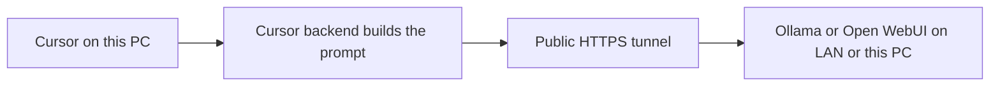

# Local and LAN models in Cursor

Yes. Cursor Settings has **Override OpenAI Base URL**, and that is the hook for Ollama or Open WebUI. It does not accept `localhost` or a LAN IP. Cursor staff (Feb–May 2026) say every custom-model request is built on Cursor’s servers first, so the endpoint has to be public HTTPS. Native LAN support has no timeline. Sources: [Bring your own API key](https://cursor.com/docs/settings/api-keys), [staff reply on local models](https://forum.cursor.com/t/how-can-i-use-a-local-llm-on-my-desktop-ai-computer/152419), [LAN request](https://forum.cursor.com/t/add-an-option-to-add-local-model-in-the-same-machine-or-lan-with-just-the-ip-and-http/148311).

This PC and the other machine are the same from Cursor’s point of view. Ollama on this CachyOS box still needs the tunnel. The GPU only changes speed.

## What you actually save

On an **individual** plan (Pro, Pro+, Ultra), requests that go out with your own API key are documented as not drawing included usage. Your provider would bill the model cost; a local model bills nothing. That is the [API keys](https://cursor.com/docs/settings/api-keys) rule applied to this override. There is no Ollama-specific billing page.

What still spends Cursor usage:

- **Tab** always uses Cursor’s model. Own keys do not apply.
- **Auto, cloud agents, automations, the CLI, and the SDK** do not take a custom OpenAI key. OpenAI’s own note: [Using OpenAI models in Cursor](https://help.openai.com/en/articles/20001506-using-openai-models-in-cursor).
- While the OpenAI key and base-URL override are on, **Composer and Grok are rejected** (“does not support custom API keys”). Those are the models in the cheaper Cursor pool. **Claude and Gemini keep working** on their own keys. Staff description: [override is global](https://forum.cursor.com/t/custom-openai-override-and-cursor-models-cannot-both-stay-enabled/172795).

So a local model replaces the model bill for Chat and Agent calls you explicitly send to it. It does not make the rest of Cursor local, and it blocks the cheap Cursor models until you turn the override off.

Prompts still leave this machine, get assembled on Cursor’s servers, then travel back through the public tunnel to your GPU. This is not private LAN inference. Cursor’s zero-data-retention policy does not apply to your own key.

Agent quality is the other limit. Cursor Agent needs reliable tool calling and a long context. A small 7B chat model usually fails the tool loop. A coding model in the 30B class, with tools enabled in Ollama, is the smallest setup worth trying, and even then it fits short edits better than a multi-step agent run on this repo.

## How to wire it

Prefer **Ollama’s OpenAI API** as the thing Cursor calls: `https://<tunnel-host>/v1`, which serves `/v1/chat/completions`.

Use **Open WebUI** in front of that if you want a key. Its compatible route is `POST /api/chat/completions` ([API endpoints](https://docs.openwebui.com/reference/)), so the Cursor base URL is `https://<tunnel-host>/api`, and the OpenAI API key field is an Open WebUI API key. Ollama itself ignores keys. Do not publish port 11434 with no auth.

1. On the GPU machine, run Ollama listening on the LAN (`OLLAMA_HOST=0.0.0.0:11434`) and pull a coding model. Give it a **plain alias** with no `:` or `-`. Cursor has rewritten names like `gpt-oss:20b` into `gptoss20bplain` and then reported “AI Model Not Found” without ever calling the server ([that thread](https://forum.cursor.com/t/connecting-local-ai-server-to-cursor-does-not-work/152940)).
2. Put Cloudflare Tunnel or ngrok in front, HTTPS only. If you skip Open WebUI, put a bearer check on the proxy. A raw Ollama port on the internet is an open model.
3. In Cursor: **Settings → Models**. Turn on the OpenAI API key (the proxy or Open WebUI key, not a real OpenAI key). Turn on **Override OpenAI Base URL**. Set `https://<tunnel-host>/v1` for Ollama, or `https://<tunnel-host>/api` for Open WebUI. Add the plain model name and select it in Chat or Agent.
4. To use Composer or Grok again, turn the OpenAI key and the override off. Claude and Gemini can stay selected with the override on.

No WARHOST repo changes. This is editor and homelab setup only.

## If the goal is fewer tokens on simple agent work

The path that stays inside Cursor, with no tunnel and no lost Composer/Grok access, is to pick a Cursor-pool model for the short tasks and a frontier model only when the task needs it. A local model is worth it when you want zero provider cost on a specific Chat or light Agent session and you can tolerate toggling the override and weaker tool use.